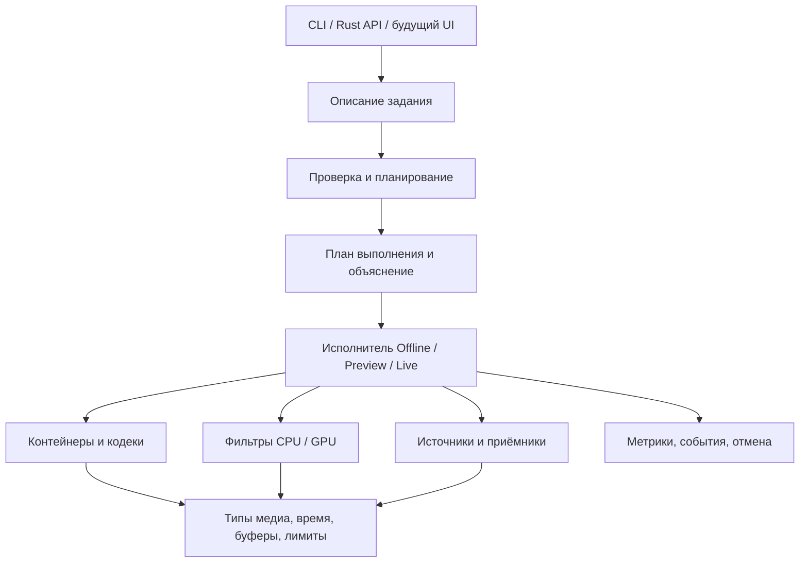

# Fvid: архитектура Rust-медиадвижка

Статус: проект архитектуры, 5 сентября 2026 (Asia/Tbilisi). Реализованы Y4M-конвейер, GPU-фильтры через Metal/Vulkan/DX12/GL и отдельный CUDA-адаптер: [статус GPU](GPU.md). Затем добавлен [native media adapter](MEDIA.md) с remux, strict trim/concat и decode→crop→FFV1. Граф общего назначения и codec/device interop ниже остаются предлагаемыми контрактами. [Матрица функций](FEATURE_MATRIX.md) различает реализацию и roadmap.

## Решение

**Уточнённый продуктовый приоритет:** обрезка по времени, кроп и склейка без потери качества и лишних копий в памяти. [Контракты и порядок реализации](LOSSLESS_EDITING.md) имеют приоритет перед расширением числа GPU-backend. Streamcopy для допустимых операций, FrameView для геометрии и явно выбранный lossless export — разные пути, с разными гарантиями.

Уже реализован фиксированный [resident GPU-конвейер](GPU_RESIDENT.md): несколько фильтров на одной queue/stream без промежуточных host transfers, с удержанием frame storage и явным download. Общий граф и аппаратные codec-surface adapters остаются проектным этапом.

Создаём компактное Rust-ядро с проверяемыми контрактами кадров, времени, памяти и выполнения. Вокруг него — заменяемые адаптеры контейнеров, кодеков и устройств. Цель первой полноценной версии: локальный экспорт и пакетная обработка обычных видеофайлов с объяснимым планом выполнения и контролируемыми ресурсами. Real-time и монтажное превью разделяют модель медиа, но получают собственные политики исполнения.

Требование к целевой архитектуре: контейнеры и кодеки реализуются в библиотеке FVid; FFmpeg используется только для бенчмарков. Сторонние декодеры и обёртки над libav не заменяют собственную реализацию. Текущий legacy `fvid-media` этому требованию не соответствует и ещё не удалён. Независимый `fvid play` использует `fvid::playback` и не подключает этот адаптер. Сейчас он поддерживает только несжатое Y4M; собственных H.264/H.265/AAC пока нет. Этапы перехода и проверенные ограничения описаны в [NATIVE_PLAYBACK.md](NATIVE_PLAYBACK.md).

Исследован ландшафт **633 репозиториев, включая FFmpeg**: 632 конкурента, компонента и смежных продукта. Это не 632 взаимозаменяемых аналога. Для 630 есть README; в 18 проектах предметно просмотрены выбранные участки 33 файлов. Остальные прошли ручной отбор по метаданным и автоматический поиск архитектурных сигналов в README. [Методика и ограничения](../research/REPORT.md), [полный каталог](../research/CATALOG.md), [предметные выводы с исходниками](../research/FINDINGS.md).

## Что действительно стоит улучшать относительно FFmpeg

Утверждения «FFmpeg монолитен», «не умеет zero-copy», «не имеет графа» и «копирует каждый фильтр» не выдерживают проверки. Его библиотеки разделены; scheduler описывает DAG и проверку циклов; AVFrame поддерживает разделяемые буферы; обычные crop/vflip меняют представление кадра. Подтверждения: `ffmpeg_sched.h`, `frame.h`, `vf_crop.c`, `vf_vflip.c` в [индексе исходников](../research/source-index.json).

Реальные направления улучшения нашего API:

| Ограничение / сложность | Наше решение | Цена решения |
|---|---|---|
| C-контракты владения и допустимых состояний требуется соблюдать вручную | Проверенные конструкторы, владение ресурсами, отдельные состояния backend | Сложнее адаптеры; unsafe внутри внешней библиотеки не исчезает |
| Выбор форматов и преобразований трудно понять до запуска | `prepare` возвращает явный план, причины конверсий, выбранные устройства и бюджет | Динамические потоки всё равно могут потребовать перепланирования |
| Локальный лимит очереди не равен лимиту всего задания | Учёт всей удерживаемой памяти, DPB, lookahead, поверхностей и незавершённых GPU-задач | Для непрозрачного драйвера строгую верхнюю границу обещать нельзя |
| Приложению трудно восстановить контекст сбоя | Структурированные ошибки с node/stream/PTS/offset/backend | Потребуется стабильная схема диагностик |
| Общие настройки потоков могут давать лишний параллелизм | Один бюджет CPU на задание, подбюджеты кодеков и обработки | Иногда внешним кодеком нельзя полностью управлять |
| Разные задачи требуют разных правил потери кадров | Отдельные Offline, Preview и Live политики | Больше сценариев для проверки |

Это инженерные цели, а не доказательство общего превосходства. В текущих CLI-замерах FFmpeg выигрывает несколько тестов 4K. [Результаты](../benchmarks/REPORT.md).

## Слои и зависимости

Начинаем с модулей, а не десятков пустых crates:

| Модуль | Ответственность | Не должен знать |
|---|---|---|
| `media` | Packet, VideoFrame, AudioBlock, StreamSpec, TimeBase, ColorInfo | CLI, сеть, конкретный кодек |
| `memory` | FrameLease, PlaneView, пул, BudgetPermit, GPU surface lifetime | Смысл фильтров |
| `graph` | LogicalPlan, проверки, типы портов, зависимости | Потоки ОС и файловые дескрипторы |
| `planner` | Согласование форматов, backend placement, fusion, PhysicalPlan | UI |
| `runtime` | Готовность задач, ресурсы, EOS, flush, отмена, исполнение плана | Форматы MP4/H.264 |
| `io`, `formats`, `codecs`, `filters` | Реальные узлы и адаптеры | Устройство интерфейса пользователя |
| `diagnostics` | Ошибки, трассировка, профили, explain | Исполнение стороннего кода |

Выделение в workspace-crates оправдано для `core`, `runtime`, CPU-фильтров, платформенных/FFI-backend и CLI, когда реальные зависимости начнут различаться. Backend не должен протаскивать FFmpeg, Tokio или wgpu в зависимости ядра. Практическая карта существующих и целевых границ, SOLID/DRY правила и порядок извлечения crates вынесены в [`LIBRARY_STRUCTURE.md`](LIBRARY_STRUCTURE.md). Первые шаги уже сделаны на уровне модулей: Y4M API выделен в `src/y4m.rs`; общие ошибки/аллокация/планирование worker'ов — в отдельных модулях; playback разложен по доменным каталогам с новыми сгруппированными путями и сохранением root API. Это всё ещё один Cargo crate; независимость и features ещё нужно проверить сборками `cargo test -p ...` после появления реальных package boundaries.

## Контракт медиа

**Packet** содержит stream id, codec config revision, PTS, DTS, duration, timebase, ключевую/зависимую природу пакета и неизменяемое представление байтов. `Option<Timestamp>` обозначает отсутствие времени; специальное числовое значение не маскирует его. Нельзя предполагать, что один пакет равен одному кадру.

**VideoFrame** содержит format/layout, coded и visible размеры, crop/orientation, PTS/duration, color primaries/transfer/matrix/range, chroma location, alpha mode, interlace/field order и side data. Обязательные поля проверяются конструктором. Неизвестная характеристика остаётся Unknown, а не молча становится BT.709. Изменяющий геометрию или цвет фильтр обязан обновить либо явно удалить несовместимые side data.

**AudioBlock** содержит sample format, channel layout, sample rate, количество сэмплов, PTS и delay/padding. Пакетный размер аудио не связывается с размером видеокадра. Аудио начинается одновременно с видео как модель данных; рабочий real-time аудиодвижок не притворяется частью первого Y4M-прототипа.

**Время**: `Timestamp { ticks: i64, time_base: Rational }`, ненулевые положительные знаменатели, checked arithmetic с промежуточным i128, явный режим округления при rescale. PTS и DTS различаются. Поддерживаем отрицательное начальное время, VFR, discontinuity, rollover на границе протокола. Идентификатор поколения потока после seek/format-change не позволяет старому кадру попасть в новый поток. Это развитие решений FFmpeg/Symphonia, не изобретение рационального времени заново. У OpenTimelineIO перенимаем явную шкалу времени и диапазоны, но его `RationalTime` хранит double: не выдаём его за источник точного целочисленного контракта.

## Владение и память

`FrameLease` удерживает backing storage и разрешение из бюджета. `PlaneView` описывает offset, stride, длину видимой строки и количество строк. Конструктор проверяет все крайние адреса и переполнения. Отрицательный stride представим безопасным обходом строк, без формирования недопустимой Rust-ссылки. CPU и GPU storage — разные варианты; читать GPU-память как CPU slice невозможно без явного map/download.

Crop и vflip создают новые представления над тем же storage. Hflip может оставаться orientation/view только пока следующий узел принимает такую раскладку; иначе нужен реальный kernel. На границе упаковки в Y4M/кодек материализация неизбежна. Не называть это zero-copy всего конвейера.

На разветвлении делятся неизменяемые данные. In-place разрешён только при уникальном владении, совместимом layout и завершённой работе устройства. Пул возвращает поверхность после освобождения **всех** владельцев и завершения fence, а не при выпадении первого Rust handle из области видимости. GPU-адаптер хранит ещё не завершённые ресурсы в retirement queue. Возвращённый device-lost ресурс не переиспользуется.

Бюджет задания включает input/output, историю temporal-фильтров, codec DPB/lookahead, очередь mux, временные workspace, кэш и незавершённые GPU surfaces. Один backing allocation учитывается один раз, даже если на него ссылаются десять views. Ограничения по байтам, кадрам и длительности очереди применяются вместе. Размеры кэша включены в тот же бюджет.

Нельзя обещать строгий RSS-потолок по сумме frame buffers. Библиотеки и драйверы имеют собственную память. В `explain` отделяем измеряемую/контролируемую память от оценок. Strict memory mode отклоняет backend без достаточного контракта либо использует отдельный worker с доступными ОС-ограничениями. Автоматического обещания изоляции на всех ОС нет.

## Планирование и оптимизации

`JobSpec → LogicalPlan → ValidatedPlan → PhysicalPlan → RunningJob`.

1. Проверить параметры, доступность источников, topology и совместимость типов портов.
2. Получить фактические capabilities backend: codec profile/level, pixel format, depth, размер, device, import/export handles, stride restrictions. Одного имени «H.264» недостаточно.
3. Рассмотреть packet-copy/remux там, где семантика операции допускает сохранение сжатых пакетов. Точное обрезание вне ключевого кадра не подменять округлением без согласованного режима.
4. Согласовать pixel/color/audio formats. Все вставленные конверсии становятся узлами плана.
5. Разместить узлы на CPU/GPU с учётом стоимости upload/download, sync, materialization и поддерживаемых handles. Выбор «GPU всегда быстрее» запрещён как эвристика по умолчанию.
6. Применить только доказуемые правила: views для геометрии, безопасное объединение affine/pointwise операций, устранение ненужных промежуточных буферов. Нельзя менять порядок crop/resize, нелинейный цвет, округление и alpha без сохранения семантики.
7. Назначить жизненные интервалы буферов, пулы, бюджеты очередей и CPU.
8. Выдать `explain`: выбранные backend, conversions, копии, estimated peak memory, причины отказа и отклонённые альтернативы.

Temporal-фильтр объявляет lookbehind/lookahead и поведение на краях. Он не объединяется с обычным покадровым фильтром по одному лишь совпадению форматов. Первоначально применяем небольшой набор проверенных правил; не строим собственный JIT/автотюнер до профилей.

## Исполнение и обратное давление

Наличие `async` не определяет архитектуру обработки пикселей. Небольшие линейные участки выполняются синхронно; ограниченный пул workers обрабатывает CPU-задачи; адаптеры устройств сообщают готовность через события. Сеть может использовать async отдельно. Не создавать задачу/поток на каждый пиксель, строку или тривиальный узел.

| Режим | Политика | Когда результат считается корректным |
|---|---|---|
| Offline export | Не терять кадры; ограничить производство при медленном sink; детерминированный порядок | Все выбранные кадры и аудиосэмплы доставлены, mux завершён |
| Preview | Отменять устаревшее поколение запросов; ограниченный кэш зависимостей; приоритет видимому времени | Показан кадр требуемого поколения и позиции |
| Live | Deadline/clock; явно выбранное отбрасывание видео; стратегия audio concealment и восстановления ключевого кадра | Соблюдены выбранные правила задержки/непрерывности; потери учтены |

При fan-out медленный обязательный sink тормозит источник. Необязательный preview/monitor может терять кадры по отдельной политике. Нельзя просто удалять произвольный сжатый пакет: downstream может зависеть от него. Дроп сжатого видео выполняет codec-aware recovery, например до следующей точки восстановления.

Для синхронного mux возможен deadlock, если одному входу нужны данные, а другой занял весь бюджет. План резервирует минимально необходимый запас на входы и кодеки; scheduler не удерживает глобальный lock или permit ожидания во время блокирующего I/O. Если необходимые минимумы не помещаются, job отклоняется до запуска. Плохо перемежённый вход и неизвестные зависимости требуют bounded spool или явной ошибки; «всегда обработаем в ограниченной памяти» не обещается.

Flush, EOS и cancel различаются. При EOS дренируются decoder reorder, фильтры, encoder lookahead и mux. При cancel допускается незавершённый output, который не публикуется как готовый файл. Blocking foreign call нельзя безопасно остановить произвольным прерыванием потока: cooperative timeout либо отдельный worker.

## Расширяемость, ошибки, наблюдаемость

Внутренние Rust traits не являются стабильным ABI для динамических плагинов. Сначала статически подключаемые Cargo features; затем при необходимости versioned C ABI или worker protocol. Произвольные `dyn Trait` через границу `.so/.dylib` не передаём. У каждого backend отдельные build dependencies, capability tests и лицензии. Автоматическое поле license из GitHub — подсказка, а не разрешение копировать исходники; в текущий прототип чужой код не переносился.

Errors: `InvalidInput`, `UnsupportedCapability`, `BudgetExceeded`, `CorruptPacket`, `DeviceLost`, `IoFailure`, `Cancelled`. Контекст: job/node/stream, input byte offset или packet index, PTS, backend/version, cause. Некоторые ошибки допускают skip/retry, но политика задаётся заданием. Unsupported не возвращает успешный чёрный кадр/тишину. Состояния поддержки: Declared → Implemented → CorpusValidated → Benchmarked; CLI не рекламирует поддержку, основанную только на парсинге заголовка.

Собираем per-node compute/wait time, queue bytes/time, CPU↔GPU transfer bytes, materialization count, live dropped/late frames, peak controlled memory, cancellation/drain time. События имеют версию схемы. Логи не вызывают блокировку аудиоколбэка; экспорт телеметрии работает вне критического пути. Метрики можно отключить, overhead измеряется.

Для файлового output: staging в том же каталоге, корректный finalize, атомарная публикация без перезаписи существующего файла. Crash durability требует отдельного fsync файла и каталога, где ОС поддерживает нужные гарантии; atomic visibility не означает сохранность при потере питания. В прототипе есть только no-clobber publication через hard link, без fsync.

## Откуда перенимаем решения

| Источник | Решение для Fvid | Ограничение переноса |
|---|---|---|
| FFmpeg | Frame views, rationals, DAG, codec drain, библиотечные границы | Сохранить возможности, улучшать удобство и проверяемость контракта |
| GStreamer | Negotiation, buffer pools, несколько лимитов очереди, flow events | Не переносить всю динамическую объектную модель |
| Membrane | Demand, учёт объёма, явные события и supervision как модель | Actor/process-per-element необязателен для CPU hot path |
| VapourSynth | Объявленные зависимости кадров и режим параллельности | Особенно полезно preview/temporal, не весь live runtime |
| MetalPetal | Ленивый граф, границы fusion, transient/persistent storage | Apple-specific API адаптировать, не внедрять в core |
| Halide / libvips | Отделение алгоритма от scheduling; обработка регионов | Не обещать autotuning/JIT в MVP |
| Firewheel | Скомпилированное расписание и переиспользование памяти вне callback | Реальная реализация использует unsafe; перенимаем контракт, не заявление об абсолютной безопасности |
| Symphonia / mp4parse-rust | Отдельные codecs/formats, явные типы времени, fallible allocation | Выбирать по профилям и корпусу, не только по языку |
| cros-codecs / Smelter / BMF | Device-resident frames, format-change, surface pool, готовность GPU | Linux/Apple/Vulkan capabilities различаются |
| Mediabunny / Vireo | Высокоуровневые операции поверх низкоуровневого pipeline; backpressure | WebCodecs/старый C++ toolkit — источники идей, не единый backend |
| Av1an | Параллелизм на уровне независимых сцен и фиксация завершённых частей | Швы GOP, звук и качество должны проверяться отдельно |
| OxiMedia | Публичная матрица фактической зрелости | Заявленный охват не доказывает качество; просмотренный crop материализует planes |

[Доказательства и точные ссылки](../research/FINDINGS.md).

## Проверки и критерии принятия

**Уровень 1 — контракты.** Checked dimensions, отрицательный stride, неполные/переполненные buffers, planar/interleaved audio, неизвестные timestamps, rational rescale, nonseekable I/O, отмена во время backpressure. Property tests на диапазоны и повторное использование памяти; fuzz на контейнеры и state machines.

**Уровень 2 — дифференциальная корректность.** Frame/sample counts, payload hashes для lossless, PTS/DTS, color/rotation/side-data, ошибки повреждённых файлов. FFmpeg — один из oracle; стандарты/независимые декодеры нужны, чтобы не тиражировать его ошибку.

**Уровень 3 — бенчмарки.** Разделить kernels in-memory, scheduler overhead и полное decode→filter→encode. Сравнивать один codec backend/preset/threads/device; для разных кодеков — качество/битрейт/скорость на нескольких настройках, а не одинаковый CRF. В lossless-сценарии payload equality обязательна. Для lossy использовать несколько метрик и просмотр сложных сцен; один VMAF недостаточен.

**Уровень 4 — устойчивость.** Медленный sink, длинный файл, fan-out, ошибки диска, format change, пропавшее устройство, SIGINT, авария worker, повторное открытие частичного output. На live — p50/p95/p99 latency, drift, drop/recovery, а не только FPS.

Гипотезы и пороги до оптимизации: views должны убрать materialization там, где consumer допускает layout; bounded pipeline должен оставаться в заявленном controlled budget независимо от длительности; в offline ни один кадр не теряется; overhead одного Rust-прохода не хуже выбранной baseline более чем на 5% в устойчивом long-run тесте. Порог 5% — предлагаемая цель, ещё не достигнутая гарантия. При сильном шуме вывод откладывается.

## Последовательность реализации

1. **Уже сделано:** Y4M 8-bit 420/422/444, crop/hflip/vflip, переиспользование frame buffers, ограничение памяти payload, ошибочный input отвергается, атомарная публикация файла. Корректность сравнена с FFmpeg; есть сохранённый CLI-бенчмарк.
2. **Уже добавлено после бенчмарка:** checked FrameView и CPU-запись исходных строк для identity/crop/vflip без выходного кадрового buffer. Hflip без сужения кадра теперь выполняется во входном буфере; сужающий crop+hflip сохраняет отдельный выход ради скорости. Проверены адреса заимствованных строк, корректность пикселей и бюджет одного кадра. Отделение reader/writer и новые in-memory benchmarks остаются следующей работой; измерения текущей CPU-оптимизации приведены в `../benchmarks/INPLACE_OPTIMIZATION.md`.
3. **Вертикальный срез реального продукта:** один demuxer + decoder backend + filters + encoder/muxer, корректные время/цвет/звук, packet-copy где допустимо, explain и отмена. Первый платформенный target — имеющийся macOS; переносимость ядра проверяется отдельно.
4. **Граф и ресурсы:** fan-out, bounded queues, общий CPU/memory budget, format-change, проверка медленного sink; только после рабочего среза выделять crates.
5. **Аппаратный путь:** VideoToolbox/Metal на macOS с проверкой реального surface sharing; Linux/Windows получают самостоятельные квалификации. Wgpu сам по себе не гарантирует импорт поверхности любого декодера.
6. **Preview/Live:** request generations, clock, audio realtime constraints и packet-aware drops. Сцены/распределённое выполнение — позже, после детерминированного checkpoint-контракта.

Не замораживаем сейчас собственный язык графов, сетевой API, динамический ABI, новый codec или распределённый кластер. Они не нужны для проверки главных гипотез и резко расширяют поверхность ошибок.
