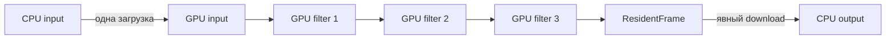

# GPU-кадры между фильтрами без возврата в RAM

Реализованы `GpuPipeline`, `UploadedFrame` и `ResidentFrame`: одна загрузка входа, последовательность GPU-фильтров и только явно запрошенная выгрузка. Есть реализации через wgpu (Metal/Vulkan/DX12/GL) и CUDA. Это завершённый путь **filter→filter**; импорт кадров аппаратного декодера и передача аппаратному энкодеру пока отсутствуют.

## Запуск

```sh
cargo build --release
./target/release/fvid input.y4m output.y4m --backend metal \
  --hflip --then --crop 2:2:1280:720 --then --vflip
```

Для NVIDIA на Linux/Windows: `--backend cuda`. Остальные варианты: `vulkan`, `dx12`, `gl`, при наличии соответствующего runtime. `--then` требует явного GPU-backend; CPU-fallback запрещён. Размеры кропа должны помещаться во входной кадр и соответствовать chroma subsampling.

Каждый `--then` начинает отдельный этап. Его координаты относятся к выходу предыдущего этапа. Внутри этапа crop по-прежнему применяется до отражений. Без `--then` остаётся прежний объединённый фильтр: crop+hflip+vflip уже выполнялись одним проходом. Новая цепочка не объявляется ускорением относительно такого объединённого прохода.



Выход этапа непосредственно используется следующим этапом как sampled texture или CUDA buffer. Между этапами нет map, upload/download или отдельного texture-to-texture/device-to-device копирования. Запись преобразованных пикселей самим shader/kernel остаётся: её нельзя считать лишней копией исходного кадра.

## Rust API и владение

```rust,ignore
let mut pipeline = fvid::resident::GpuPipeline::new(
    &header,
    &transforms,
    fvid::ExecutionOptions { backend: fvid::Backend::Metal, device: 0 },
    256 * 1024 * 1024,
)?;

let uploaded = pipeline.upload(&input)?;
let resident = uploaded.process()?;
// Здесь результат находится на GPU; download ещё не вызывался.
let transfers_before_download = resident.transfers();
resident.download(&mut output)?;
```

Создание pipeline выделяет все текстуры/буферы, bindings и параметры один раз. На каждом кадре они переиспользуются. Число этапов ограничено 1..=256; одновременно удерживается один кадр цепочки. Разрешены разные размеры выходов этапов, формат остаётся 8-bit planar YUV420/422/444.

Токен кадра эксклюзивно заимствует pipeline. Пока токен используется, Rust запрещает следующую загрузку, которая затёрла бы его storage; это проверяет compile-fail test. После `process` GPU ещё может работать. Выгрузка ждёт завершения. Если токен уничтожить без выгрузки, результат отбрасывается на GPU, а следующая работа безопасно упорядочивается той же queue/stream. Все allocations остаются у pipeline; внешние raw handles не выдаются.

GPU validation/device-lost ошибки сохраняются. После ошибок upload/readback pipeline отравляется и требует пересоздания. CUDA дополнительно проверяет порядок upload→process→download и отравляет pipeline после ошибок операций. Ошибка не запускает CPU-обработку и не публикует частичный CLI output file.

## Память и счётчики

Для N этапов заранее учитываются:

- wgpu: N+1 padded frame textures, один upload staging, один readback staging, N×128 bytes uniforms и входной/выходной CPU-буферы на границах.
- CUDA: caller host in/out, depth-2 slots (2× pinned+device for first-stage sizes), extra device outputs for later `--then` stages, N×128 params. CUDA-стек может иметь внутренние driver allocations.

Бюджет проверяется до выделения frame allocations. Он не включает все объекты драйвера/компилятора и не является строгим RSS/VRAM limit. Число allocations не растёт с длительностью ролика. Здесь пока используется фиксированный набор поверхностей для всех этапов, без динамического пула и перекрытия нескольких кадров.

`TransferStats` отдельно показывает число и payload bytes загрузок/выгрузок, padded staging bytes для wgpu и число filter passes. Загрузка неизменяемых параметров при создании pipeline не считается загрузкой кадра. Это счётчики вызовов нашего API, **не аппаратная трассировка драйвера**.

Для трёх отдельных этапов с возвратом в RAM между ними требовались бы 3 upload + 3 download на кадр. Здесь — 1 upload + 1 download. Если финальную выгрузку не запросить, download остаётся нулевым. CLI Y4M всё равно читает вход и пишет выход в CPU-памяти; полное отсутствие передач на границах CLI не заявляется.

## Проверки

```sh
cargo test
cargo test --test resident metal_resident_chain -- --ignored --nocapture
python3 scripts/validate_resident.py --backend metal
```

На NVIDIA заменить Metal на CUDA: `cargo test --test resident cuda_resident_chain -- --ignored --nocapture` и `--backend cuda` у скрипта. Если GPU отсутствует, эти проверки завершаются ошибкой; fallback не засчитывается.

На Apple M4 Max проверены:

- API: 7 вариантов размеров/форматов, в каждом 3 разных исходных кадра, затем отбрасывание результата без readback и повторное использование. В каждом варианте — 5 uploads, 4 downloads, 15 filter passes. Выгруженные пиксели совпали с CPU.
- CLI: 8 случаев по 3 кадра, включая 420/422/444, нечётный 444, 4K и порядок hflip→crop→vflip. Результаты сравнены с CPU и FFmpeg.
- Бюджет ровно на allocations и отказ на один байт ниже; неверные размеры; неподходящий порядок/геометрия; ошибка второго кадра без публикации файла.
- Компиляция и Clippy для Linux/Windows, включая CUDA. Это не исполнение на NVIDIA, Vulkan, D3D12 или GL GPU.
- Регрессия прежнего GPU API/CLI: 34 сравнения с CPU/FFmpeg и 10 проверок отказов прошли заново на Metal/auto. [Отдельный снимок](../benchmarks/gpu-resident-regression.json).

[Результаты и хеши исходников](../benchmarks/resident-results.json). Счётчики показывают отсутствие промежуточных host transfers; аппаратные traffic counters не измерялись. Затем выполнен отдельный [CLI-бенчмарк против FFmpeg](../benchmarks/RESIDENT_BENCHMARK.md): на этих операциях resident Metal медленнее FFmpeg default в 1,70–2,09 раза. Старые бенчмарки не переписаны.

## Оставшаяся граница: аппаратные кодеки

Реализован вертикальный срез на NVIDIA (Windows qualified): `cargo build --release --features media-cuda`, затем

```sh
./target/release/fvid media hw-filter input.mp4 output.mp4 --crop 16:16:320:180 --hflip --vflip
python scripts/validate_hw_cuda.py
```

Путь: FFmpeg CUDA hwaccel decode (NV12 device surfaces) → `fvid-cuda` NV12 crop/hflip/vflip (device-to-device) → `h264_nvenc`. Статистика сообщает `host_frame_copies=0` на happy path. Это не полный codec graph и не замена software lossless path.

Первый целевой путь для Apple GPU по-прежнему VideoToolbox/CVPixelBuffer/IOSurface ↔ Metal.
